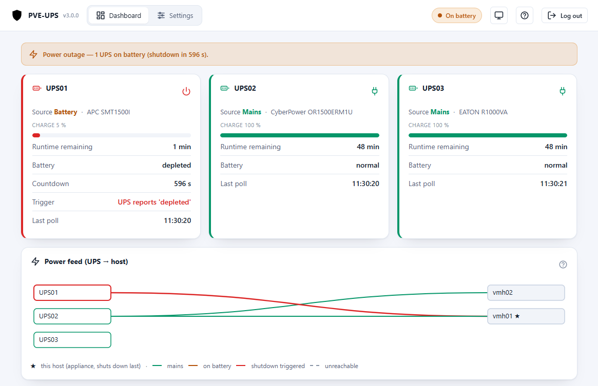
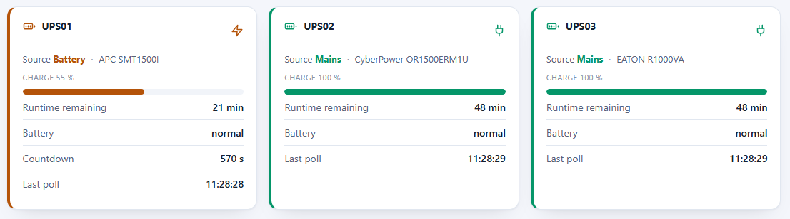
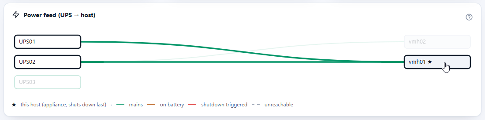
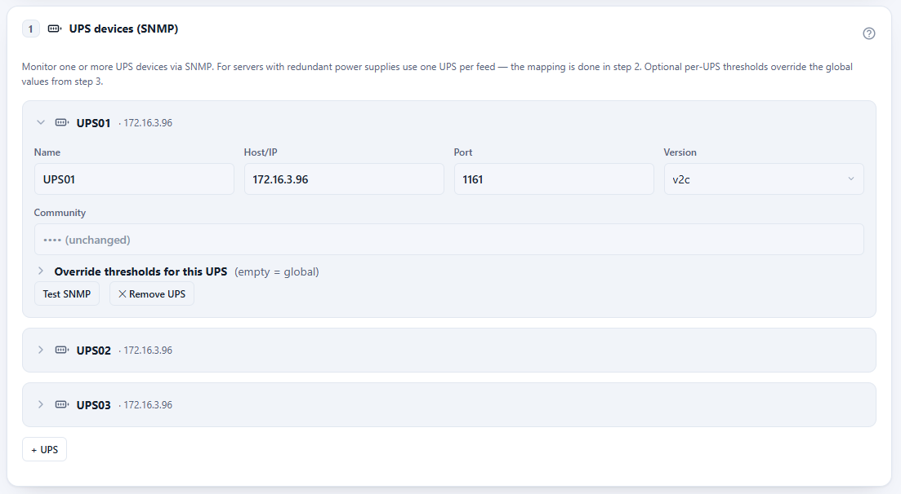
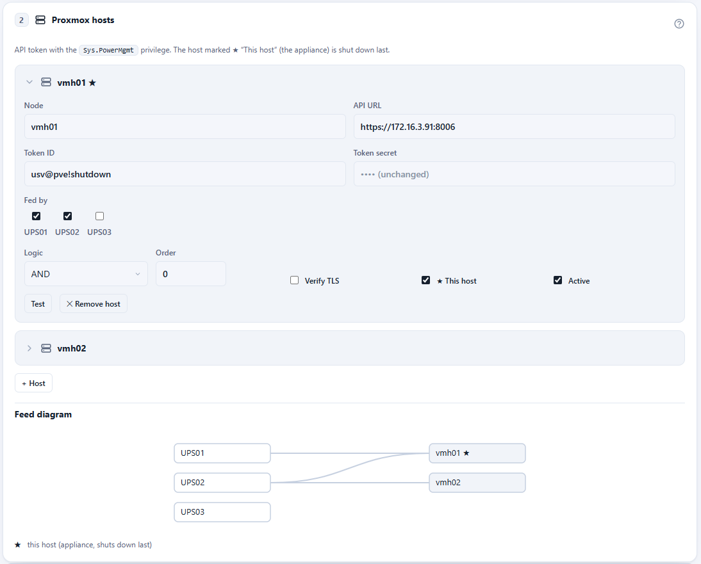

# PVE-UPS

**GUI-basierte USV-Shutdown-Appliance für Proxmox VE — eine NUT-Alternative mit
Web-Wizard und ohne Konfigurationsdateien.**

*English version: [README.md](README.md)*

PVE-UPS überwacht eine oder mehrere **USVs mit SNMP-Netzwerkkarte (Standard RFC 1628)**
und fährt bei Stromausfall einen oder mehrere **Standalone-Proxmox-VE-Hosts** geordnet
herunter — der moderne Ersatz für herstellergebundene Appliances wie APC PowerChute
Network Shutdown. Die komplette Einrichtung läuft über einen **Web-Wizard**; Monitoring
gibt es als **REST/JSON**.

## Warum nicht NUT?

[NUT](https://networkupstools.org/) ist mächtig, bedeutet für den üblichen Fall „fahre
meine Proxmox-Hosts herunter, wenn die USV zur Neige geht" aber Treiber-Zuordnung,
`upsd`-/`upsmon`-Konfigdateien und eigene Shutdown-Skripte auf jedem Host. PVE-UPS geht
stattdessen den Appliance-Weg:

- **Ein LXC, ein Installer** — ein unprivilegierter Debian-Container (~256 MB RAM),
  angelegt mit einem einzigen Befehl auf dem PVE-Host.
- **Keine Konfigdateien** — ein Web-Wizard mit Test-Buttons für jeden Schritt;
  Einstellungen greifen sofort.
- **Keine Agenten auf den Hosts** — der Shutdown läuft über die Proxmox-API mit einem
  dedizierten, widerrufbaren **API-Token**, das nur das Recht `Sys.PowerMgmt` besitzt.
  Nirgendwo Root-SSH.
- **Herstellerneutral** — liest ausschließlich die Standard-RFC-1628-UPS-MIB per
  SNMP v1/v2c/v3 (reine Python-Implementierung, kein net-snmp).

## Screenshots

*Dashboard während eines Stromausfalls — eine USV im Akkubetrieb, Shutdown-Countdown läuft:*



<details>
<summary>Weitere Screenshots (USV-Status, Schaubild, USV- &amp; Host-Einstellungen)</summary>

*USV-Statuskarten:*



*Live-Schaubild der Versorgung (USV → Host):*



*USV-Einstellungen mit Schwellen-Overrides je USV:*



*Host-Einstellungen (API-Token, Versorgung, UND/ODER-Logik):*



</details>

## Installation

In der **Proxmox-Node-Shell** ausführen (Webinterface → Node → `>_ Shell`, als root).
Das Skript lädt das aktuelle Release nach, entpackt es und legt den LXC an:

```bash
bash -c "$(curl -fsSL https://github.com/ffind-dev/pve-ups/releases/latest/download/install.sh)"
# mit Optionen, z.B. fester IP:
curl -fsSL https://github.com/ffind-dev/pve-ups/releases/latest/download/install.sh | bash -s -- \
  --ctid 950 --ip 10.0.0.50/24 --gateway 10.0.0.1 --hostname pve-usv
```

Danach das Webinterface auf **`http://<container-ip>:8080`** öffnen:
1. UI-Passwort setzen.
2. Wizard durchlaufen (USVs → Hosts → Schwellwerte → optional Webhook).
3. Solange **Dry-Run** aktiv ist, wird nichts heruntergefahren — ideal zum Testen.
4. Wenn alles passt: **Dry-Run deaktivieren** (Modus „SCHARF").

> Der LXC läuft typischerweise auf einem der zu schützenden Hosts. Diesen in der
> Host-Liste als **„Dieser Host"** markieren — er wird dann garantiert zuletzt
> heruntergefahren.

## Proxmox-Host anbinden (API-Token)

Die Appliance fährt Hosts über die Proxmox-API herunter — kein Root-SSH, kein Agent auf
dem Host. Jeder Host braucht einen dedizierten Benutzer mit **einem einzigen Recht**
(`Sys.PowerMgmt`) und einen API-Token. Einmalig je Host in der Node-Shell (als root):

```bash
# 1) Dedizierten Benutzer anlegen (PVE-Realm)
pveum user add ups@pve

# 2) Rolle mit nur dem Power-Management-Recht
pveum role add UpsShutdown -privs "Sys.PowerMgmt"

# 3) Rolle auf /nodes vergeben (oder enger: /nodes/<name>)
pveum acl modify /nodes -user ups@pve -role UpsShutdown

# 4) API-Token erzeugen — Privilege Separation AUS, damit der Token das Recht erbt
pveum user token add ups@pve shutdown --privsep 0
```

Der letzte Befehl gibt die **Token-ID** (`ups@pve!shutdown`) und das **Secret** aus (eine
UUID, wird nur dieses eine Mal angezeigt — jetzt kopieren). Beides im Wizard unter
**Proxmox-Hosts** eintragen (API-URL ist `https://<host-ip>:8006`) und die Verbindung mit
**Test** prüfen.

- **TLS prüfen** aus lassen, solange der Host das selbstsignierte Proxmox-Zertifikat nutzt.
- Der Token ist jederzeit widerrufbar: `pveum user token remove ups@pve shutdown`.

## Funktionen

- **Mehrere USVs** pro Instanz mit Host↔USV-Zuordnung und Logik pro Host
  (**UND** = redundante Netzteile, **ODER** = aufgeteilte Last), inkl. Live-Schaubild.
- **SNMP v1/v2c und v3** (authPriv), RFC-1628-UPS-MIB, nur lesend.
- **Web-Wizard** für USVs, Hosts, Schwellwerte und Benachrichtigungen — mit Test-Buttons.
- **Zweisprachige Oberfläche**: Englisch (Standard) und Deutsch, automatisch passend
  zur Browsersprache; eingebautes Benutzerhandbuch (beide Sprachen).
- **Schwellen-Overrides je USV** zusätzlich zu den globalen Standardwerten.
- **Webhook-Benachrichtigungen** (HTTP-POST mit subject/body/status-JSON) bei wichtigen
  Ereignissen.
- **REST-Status** (`/api/status`, `/api/health`) — lesend, ohne Auth, ohne Secrets;
  Ereignisprotokoll der letzten 48 h inklusive. Ereignis-/Webhook-Texte sind einheitlich
  englisch.
- **Konfigurations-Export/-Import**, NTP/Zeitzone, täglicher Proxmox-Selbsttest,
  In-Place-**Updates per Paket-Upload** im Webinterface.

## Sicherheitsmodell

- **Fail-safe als Standard:** ein SNMP-Verbindungsverlust ist *kein* bestätigter
  Stromausfall — er löst Alarm aus und fährt nie etwas herunter. Zwei explizite Opt-ins
  verfeinern das: einen bestätigten Akkubetrieb-Countdown über den Verbindungsverlust
  hinweg fortsetzen (Standard an) und einen anhaltenden reinen Kommunikationsverlust doch
  als Ausfall behandeln (Standard aus).
- **Dry-Run als Standard:** nach der Installation protokolliert die Engine nur, was sie
  tun würde. Ein **Test-Shutdown** simuliert die Abschaltreihenfolge ohne Wirkung.
- Ein ausgelöster Trigger und der Akkubetrieb-Countdown werden **auf Platte persistiert**
  und überstehen einen Dienst-Neustart.
- **„Eigener Host zuletzt":** der Host, der die Appliance trägt, fährt immer zuletzt
  herunter.
- Die App läuft **unprivilegiert**; ein schmaler privilegierter Begleiter wendet Updates
  und NTP-/Zeitzonen-Änderungen an. Secrets verlassen die Appliance nie über die API.

## Standard-Auslöser

Es genügt **eine** zutreffende Bedingung (im Wizard änderbar; Feld leeren = aus):

| Bedingung | Standard |
|---|---|
| Akkubetrieb länger als | 600 s |
| Restlaufzeit unter | 10 min |
| Ladestand unter | 30 % |
| USV meldet `battery low/depleted` | an |

Poll-Intervall: 30 s im Netzbetrieb, 8 s im Akkubetrieb.

## Updates

Das Release-Paket (`pve-usv-<version>.tar.gz`) von der
[Release-Seite](https://github.com/ffind-dev/pve-ups/releases) herunterladen und im
Webinterface unter **Update** hochladen. Die Konfiguration bleibt erhalten; der Dienst
startet automatisch neu. Das Update von 2.x funktioniert genauso (die zwei
Verhaltensänderungen stehen im Handbuch).

> **Hinweis:** Der Produktname ist PVE-UPS, technisch heißen Dienst und Pfade aber
> `pve-usv` (`systemctl status pve-usv`, `/etc/pve-usv/config.yaml`,
> `/var/lib/pve-usv/`). Das ist beabsichtigt und hält bestehende Installationen kompatibel.

## Entwickeln / testen ohne Hardware

```bash
python -m venv .venv && . .venv/bin/activate
pip install -e ".[dev]"
pytest                       # Unit-Tests, keine Hardware nötig

# USV simulieren (separates Terminal); Snapshots unter ./snmpdata/:
snmpsim-command-responder --data-dir=./snmpdata --agent-udpv4-endpoint=127.0.0.1:1161
PVE_USV_CONFIG=./dev-config.yaml PVE_USV_DB=./dev-events.db python -m app.main
# UI: http://127.0.0.1:8080 — SNMP-Host 127.0.0.1, Port 1161,
#   Community "public"  -> Netzbetrieb (100 %)
#   Community "battery" -> Stromausfall (Akku, 22 %, 3 min) -> Auslöser greifen
```

## Grenzen / Annahmen

- Nur Standalone-Hosts (kein Cluster-/HA-Manager-Eingriff) — mögliche spätere Erweiterung.
- Liest ausschließlich die Standard-RFC-1628-UPS-MIB (herstellerunabhängig).

## Lizenz

MIT — Copyright © 2026 Florian Finder. Siehe [LICENSE](LICENSE).
